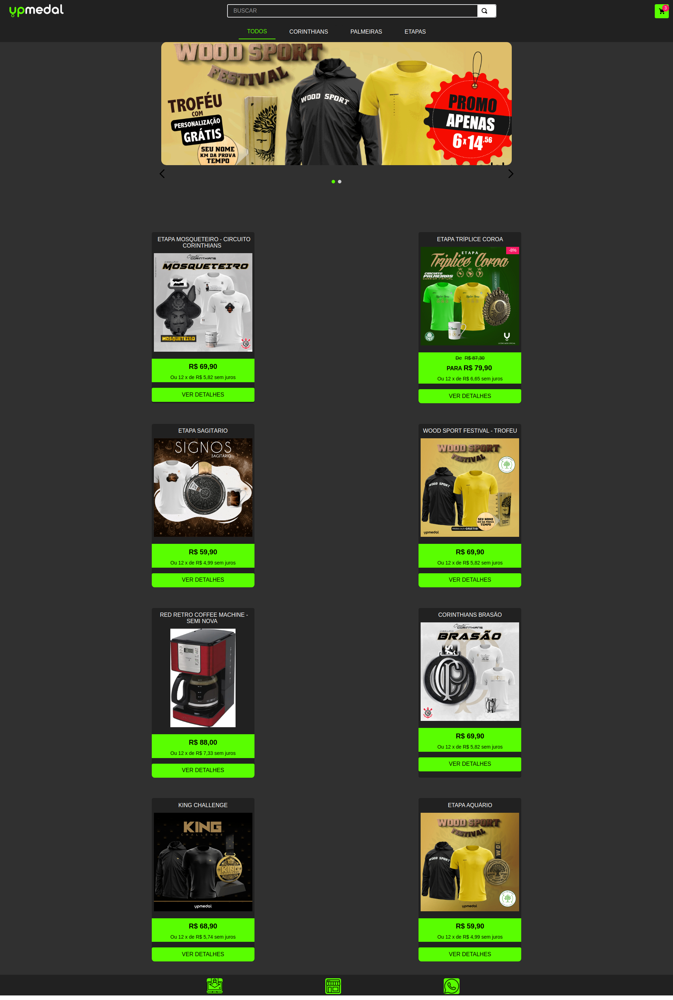
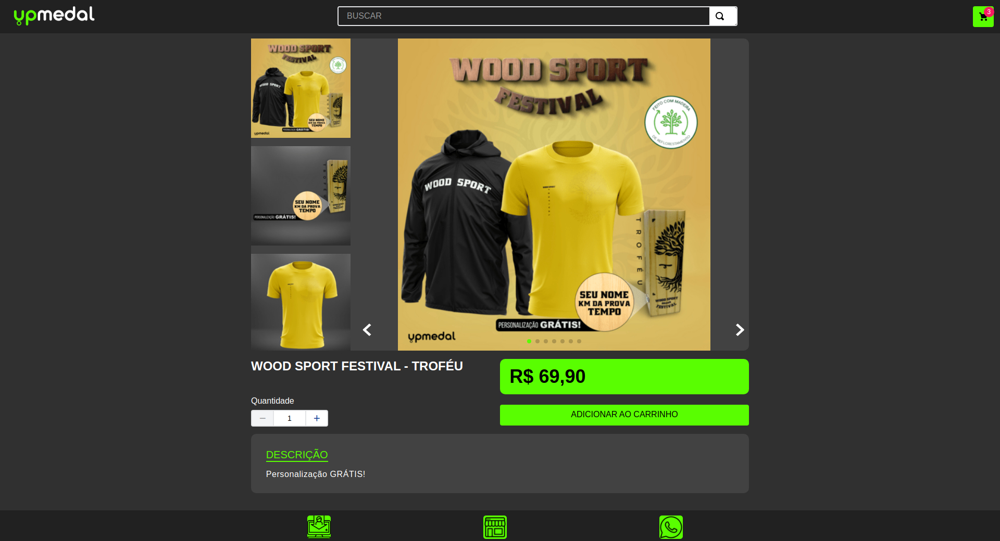
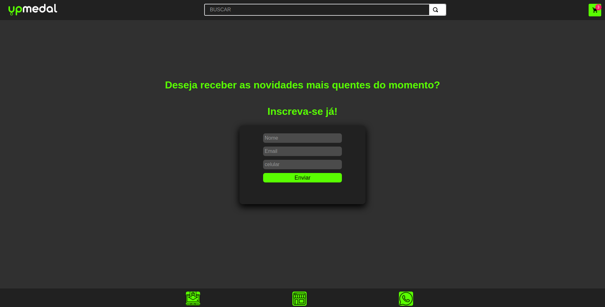
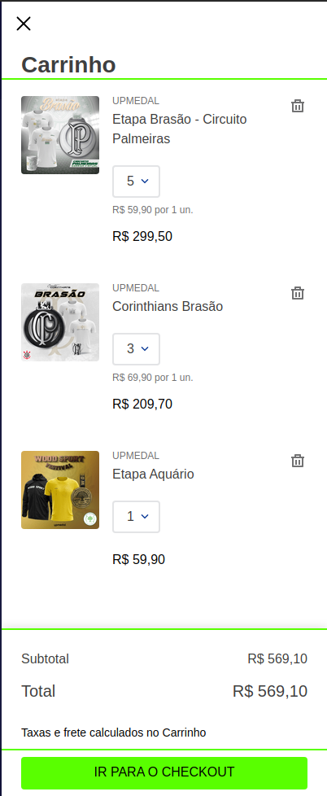

# Desafio 3 - Hiring Coders
## Criar um Ecommerce com Vtex IO

### A aplicação - Loja UpMedal

Este projeto tem por finalidade simular um ecommerce simples contendo um carrosseis e prateleiras de produtos. Assim como páginas para produtos, categorias e uma página de formulario.

### Rodando localmente

Para iniciar o desenvolvimento, é necessário clonar o projeto do Github em um diretório de sua preferência: 

`git clone https://github.com/jovenan/Desafio-HC-Vtex-IO.git`

Para que você consiga rodar o site localmente, é necessario ter uma conta Vtex e ter um workspace de desenvolvimento. Para isso, recomendo acessar o seguinte site:

<a href="https://learn.vtex.com/page/configurando-seu-ambiente" target="_blank">https://learn.vtex.com/page/configurando-seu-ambiente</a>

Para iniciar em modo de desenvolvimento, rode esse comando na pasta raiz:

`vtex link`

Abra outro terminal em paralelo, e dentro dele, abra a pasta do tema "UpMedal-Theme":

`cd UpMedal-Theme`

Rode novamente o comando dentro desse terminal:

`vtex link`

### Páginas

- Home:

- Produto:

- Formulario:

### Funcionalidades

- Header do site onde é possivel utilizar da barra de busca, minicart e da categorização dos produtos:

- Footer do site onde é possivel utilizar para navegar para a página do formulario, página Home e abrir o suporte pelo Whatsapp:

- Minicart do site, onde é possivel visualizar os produtos que foram selecionados para compra, seguido pelo botão que leva ao checkout:

### Desenvolvedor Jonatas Venâncio